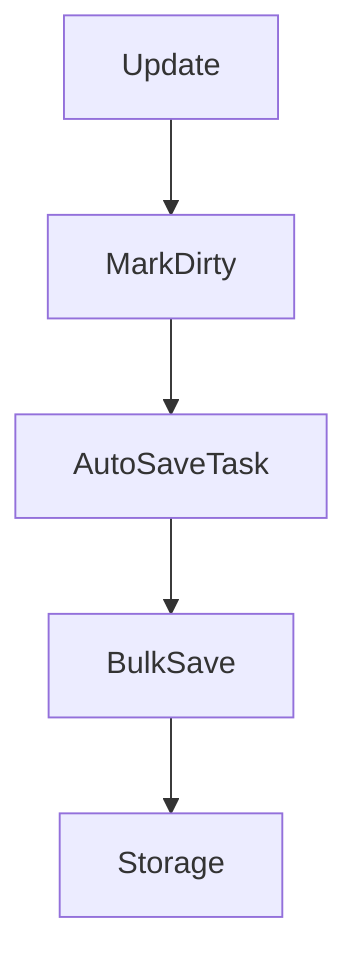

# Cache System

The cache stores `UUID -> Map<currency, balance>` using Caffeine.

## Characteristics

- Max size: 5000 entries
- Expire after access: 30 minutes
- Dirty tracking: updated UUIDs are tracked for bulk save

```java
cache.put(uuid, balances);        // Insert and mark dirty
cache.updateCurrency(uuid, key);  // Update and mark dirty
getAndClearDirtyPlayers();        // Snapshot and clear
```

## Save Flow



!!! warning
    Avoid calling `saveSync()` on the main thread. Backends log a warning.
