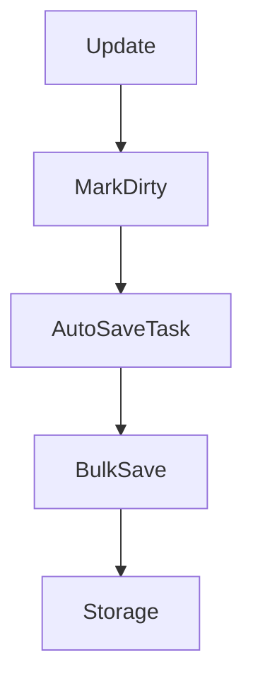

# Cache System

The cache stores `UUID -> Map<currency, balance>` using Caffeine.

## Characteristics

- Max size: 10000 entries
- Expire after access: 30 minutes
- Dirty tracking: updated UUIDs are tracked for bulk save

```java
cache.put(uuid, balances);              // Insert and mark dirty
cache.updateCurrency(uuid, key, value); // Update and mark dirty
cache.getAndClearDirtyPlayers();        // Snapshot and clear
```

## Save Flow



!!! warning
    Avoid calling `saveSync()` on the main thread. Both SQLite and MySQL log a warning when it happens.

## Relevant Methods

- `put(UUID, Map<String, Double>)`
- `get(UUID)`
- `contains(UUID)`
- `updateCurrency(UUID, String, double)`
- `getAll()`
- `invalidateAll()`
- `getAndClearDirtyPlayers()`
- `getDirtySize()`
