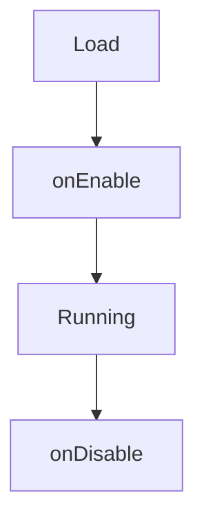

# Economy Modules

SimpleEconomy can load external modules via `EconomyModule` and a dedicated loader. Each module must:

1. Include `module.yml` at the JAR root.
2. Provide a class implementing `EconomyModule`.
3. Be placed in `plugins/SimpleEconomy/modules/`.

The `ModuleManager` loads JARs from that folder at startup and the `/modules loadfromfile` command can load one manually at runtime.

## module.yml

```yaml
name: "MyModule"
main: "com.example.mymodule.MyModule"
```

!!! warning
    If `module.yml` is missing or incomplete, the module is rejected.

The loader also validates that the declared main class implements `EconomyModule`.

## Lifecycle



### onEnable(core, moduleFolder)

- `core` is the `EconomyCore` view of the main plugin.
- `moduleFolder` is the module data folder under `plugins/SimpleEconomy/modules/<moduleName>/`.

### onDisable()

- Close resources and unregister listeners.

## Full Example (Java)

```java
package com.example.mymodule;

import it.alzy.simpleeconomy.api.EconomyCore;
import it.alzy.simpleeconomy.api.EconomyModule;
import it.alzy.simpleeconomy.api.EconomyProvider;
import it.alzy.simpleeconomy.api.SimpleEconomyAPI;

import java.io.File;

public class MyModule implements EconomyModule {

    private EconomyProvider provider;

    @Override
    public void onEnable(EconomyCore core, File moduleFolder) {
        core.getCoreLogger().info("Enabling MyModule");
        this.provider = SimpleEconomyAPI.getProvider();

        if (!moduleFolder.exists()) {
            moduleFolder.mkdirs();
        }
    }

    @Override
    public void onDisable() {
        // Release resources (tasks, files, connections)
    }

    @Override
    public String getName() {
        return "MyModule";
    }
}
```

## Related Command

`/modules`

- Permission: `simpleconomy.command.modules`
- `list` shows loaded module names
- `disable <name>` disables a loaded module
- `status <name>` shows whether a module is enabled
- `loadfromfile <file.jar>` loads a JAR from the modules folder

## Module Data Model

Loaded modules are wrapped in `LoadedModule`, which tracks:

- the instantiated `EconomyModule`
- the module class loader
- the source JAR file
- the module-specific data folder
