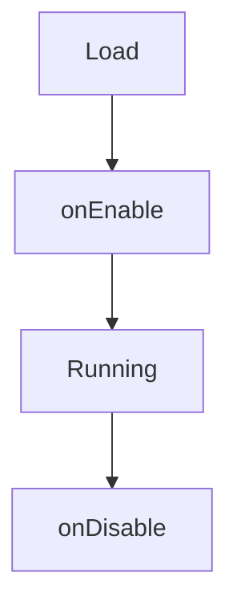

# Economy Modules

SimpleEconomy can load external modules via `EconomyModule` and a dedicated loader. Each module must:

1. Include `module.yml` at the JAR root.
2. Provide a class implementing `EconomyModule`.
3. Be placed in `plugins/SimpleEconomy/modules/`.

## module.yml

```yaml
name: "MyModule"
main: "com.example.mymodule.MyModule"
```

!!! warning
    If `module.yml` is missing or incomplete, the module is rejected.

## Lifecycle



### onEnable(core, moduleFolder)

- `core` is the main plugin instance.
- `moduleFolder` is the module data folder.

### onDisable()

- Close resources and unregister listeners.

## Full Example (Java)

```java
package com.example.mymodule;

import it.alzy.simpleeconomy.api.EconomyModule;
import it.alzy.simpleeconomy.api.SimpleEconomyAPI;
import it.alzy.simpleeconomy.api.EconomyProvider;

import java.io.File;

public class MyModule implements EconomyModule {

    private EconomyProvider provider;

    @Override
    public void onEnable(Object core, File moduleFolder) {
        // Resolve the provider when the module starts
        this.provider = SimpleEconomyAPI.getProvider();

        // Ensure the data folder exists
        if (!moduleFolder.exists()) {
            moduleFolder.mkdirs();
        }
    }

    @Override
    public void onDisable() {
        // Release resources (tasks, files, connections)
    }

    @Override
    public String getName() {
        return "MyModule";
    }
}
```

!!! note
    Never call Bukkit API from async callbacks. Switch to the main thread first.
