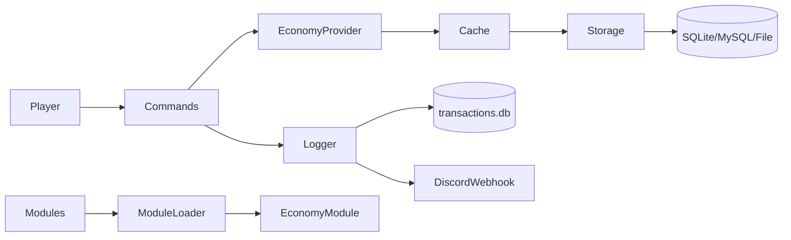

# SimpleEconomy

SimpleEconomy is a modern economy plugin for Spigot/Paper with multicurrency support, pluggable storage, and a modular extension system.

!!! warning
    This branch is in active development. Multicurrency and the module system are evolving. Use in test environments only.

## Core Highlights

- Multicurrency-first data model. Every operation depends on a currency key.
- Storage backends: SQLite, MySQL, and File (YAML), with cache and dirty tracking.
- Asynchronous API powered by `CompletableFuture`.
- Advanced logging: local transaction DB and Discord webhook support.
- External modules via `EconomyModule`.

## High-Level Architecture

!!! note
    Economy operations are asynchronous. When interacting with Bukkit APIs, return to the main thread.
