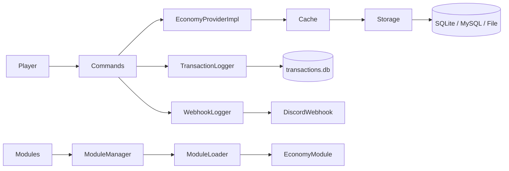

# SimpleEconomy

SimpleEconomy is a Spigot/Paper economy plugin whose runtime package is `it.alzy.simpleeconomy.plugin` and whose public API lives under `it.alzy.simpleeconomy.api`.

!!! warning
    This documentation tracks the current codebase. Commands, config keys, and API signatures are aligned with the implementation in this workspace.

## Core Highlights

- Default economy is `money`, with runtime-created virtual currencies loaded from `currencies.yml`.
- Storage backends: SQLite, MySQL, and File storage, all backed by a UUID plus currency balance model.
- Asynchronous API powered by `CompletableFuture` and exposed through `SimpleEconomyAPI`.
- Transaction history logging, Discord webhook logging, update checks, and optional interests.
- External modules via `EconomyModule` and `module.yml` inside module JARs.

## High-Level Architecture

!!! note
    Balance and transaction operations are asynchronous. When a callback needs Bukkit state, schedule the work back onto the main thread.

## What This Wiki Covers

- [Installation](user-guide/installation.md)
- [Configuration](user-guide/configuration.md)
- [Commands and Permissions](user-guide/commands-permissions.md)
- [Storage](advanced/storage.md)
- [Cache](advanced/cache.md)
- [Multicurrency](advanced/multicurrency.md)
- [Logging](advanced/logging.md)
- [Build and Release](contributors/build-release.md)
- [API Reference](api/reference.md)
- [Modules](extensibility/modules.md)
